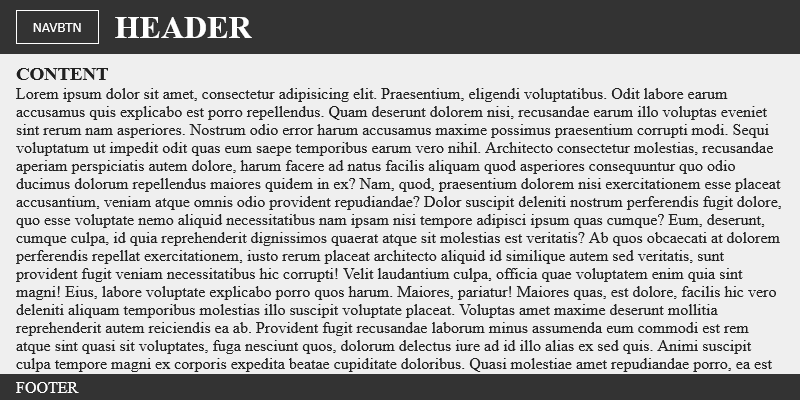
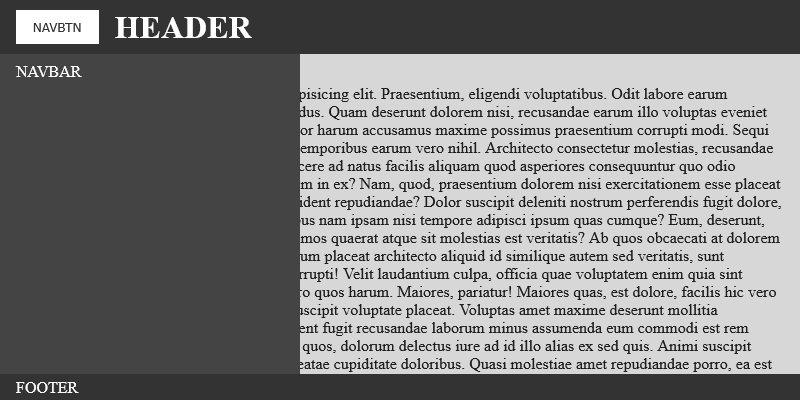
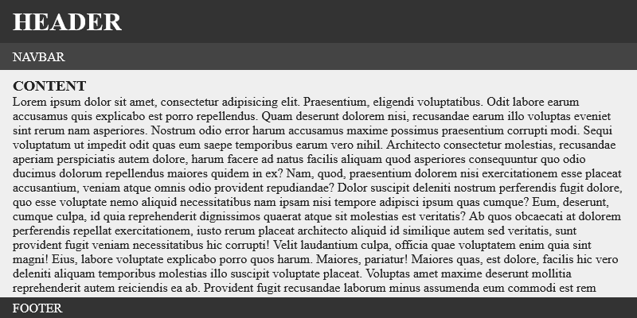
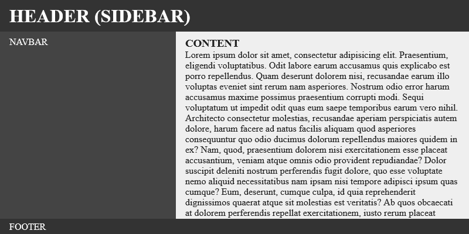

# `layout.js`

Ein leichtgewichtiges jQuery Widget für responsives Layout-Management. Es ermöglicht einen nahtlosen Wechsel zwischen mobilen und Desktop-Ansichten durch automatische Anpassung an die Fenstergröße. Die integrierte Navigation mit Ein-/Ausblend-Animation und Overlay sorgt für optimale Benutzerfreundlichkeit auf allen Geräten.

## Hauptmerkmale:

- **Responsives Layout**: Wechselt automatisch zwischen mobilen und Desktop-Layouts je nach Fenstergröße.
- **Navigation**: Ermöglicht das Ein- und Ausblenden der Navigation mit Animation und Overlay.
- **CSS-Klassenverwaltung**: Verwendet CSS-Klassen zur Steuerung der Layout- und Navigationsdarstellung.
- **Dynamische Anpassung**: Erkennt Änderungen der Fenstergröße und passt das Layout entsprechend an.
- **Sidebar-Unterstützung**: Optionale Sidebar-Funktionalität für komplexere Layouts.

## Systemvoraussetzungen:

- jQuery 1.7 oder höher
- jQuery-UI 1.8 oder höher (mindestens Core => Widget)
- Moderne Browser mit CSS3-Unterstützung

## Methoden:

### `destroy`

Zerstört das Widget und entfernt alle Event-Listener.

```javascript
$(function () {
  $("#layout").layout("destroy");
});
```

## Optionen:

| Option       | Typ     | Beschreibung                                          | Standardwert |
| ------------ | ------- | ----------------------------------------------------- | ------------ |
| `breakpoint` | Number  | Breite in Pixel für den Layout-Wechsel                | `1200`       |
| `sidebar`    | Boolean | Aktiviert/Deaktiviert die Sidebar-Funktionalität      | `false`      |
| `duration`   | Number  | Animationsdauer in Millisekunden                      | `300`        |
| `easing`     | String  | Easing-Funktion für Animationen                       | `"linear"`   |
| `navbtn`     | String  | Selector für den Navigation-Toggle-Button             | `"#navbtn"`  |
| `navbar`     | String  | Selector für die Navigationsleiste                    | `"#navbar"`  |
| `overlay`    | String  | Selector für das Overlay-Element                      | `"#overlay"` |
| `classes`    | Object  | Objekt zur Konfiguration der verwendeten CSS-Klassen. | Siehe unten  |

### CSS-Klassen-Konfiguration (`classes`)

| Option          | Typ    | Beschreibung                                 | Standardwert       |
| --------------- | ------ | -------------------------------------------- | ------------------ |
| `layoutDesktop` | String | CSS-Klasse für das Desktop-Layout            | `"layout-desktop"` |
| `layoutMobile`  | String | CSS-Klasse für das mobile Layout             | `"layout-mobile"`  |
| `layoutSidebar` | String | CSS-Klasse für das Sidebar-Layout            | `"layout-sidebar"` |
| `navbtnActive`  | String | CSS-Klasse für den aktiven Navigation-Button | `"active"`         |

## Installation:

Klone das Repository:

```sh
git clone https://github.com/K3nguruh/layout.git
```

## Verwendung:

### Einbinden der erforderlichen Dateien:

```html
<link href="assets/styles/layout.min.css" rel="stylesheet" />

<script src="assets/scripts/jquery.min.js"></script>
<script src="assets/scripts/jquery-ui.min.js"></script>
<script src="assets/scripts/layout.min.js"></script>
```

### Beispiel HTML:

Das Widget wird durch Hinzufügen von `data-plugin="layout"` automatisch initialisiert:

```html
<body id="layout" data-plugin="layout">
  <div id="header">
    <button id="navbtn"></button>
  </div>
  <div id="navbar"></div>
  <div id="content"></div>
  <div id="overlay"></div>
</body>
```

### Beispiel mit Standardoptionen:

```javascript
$(function () {
  $("#layout").layout();
});
```

### Beispiel mit benutzerdefinierten Optionen:

```javascript
$(function () {
  $("#layout").layout({
    breakpoint: 1000,
    sidebar: true,
    duration: 500,
    easing: "easeInOutQuad",
    classes: {
      layoutDesktop: "custom-desktop",
      layoutMobile: "custom-mobile",
      layoutSidebar: "custom-sidebar",
      navbtnActive: "nav-active",
    },
  });
});
```

## Beispiel-Layouts:


<br>_Mobile Layout mit geschlossener Navigation_


<br>_Mobile Layout mit geöffneter Navigation_


<br>_Desktop Layout mit horizontaler Navigation_


<br>_Desktop Layout mit Sidebar Navigation_

## Zusätzliche Informationen

- **Lizenz**: MIT
- **Issues/Bugs**: [GitHub Issues](https://github.com/K3nguruh/layout/issues)

## Lizenz

Dieses Projekt ist unter der MIT-Lizenz lizenziert. Siehe [LICENSE](LICENSE) für Details.
