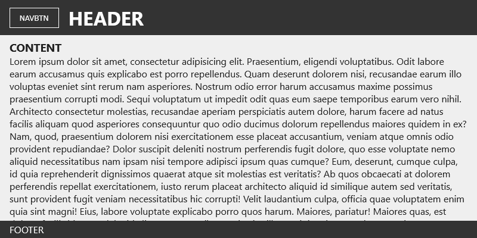
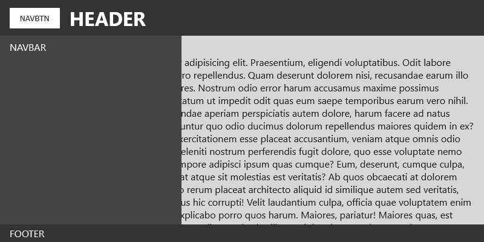
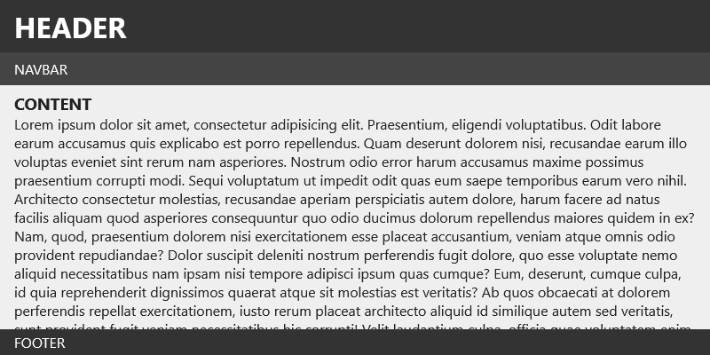
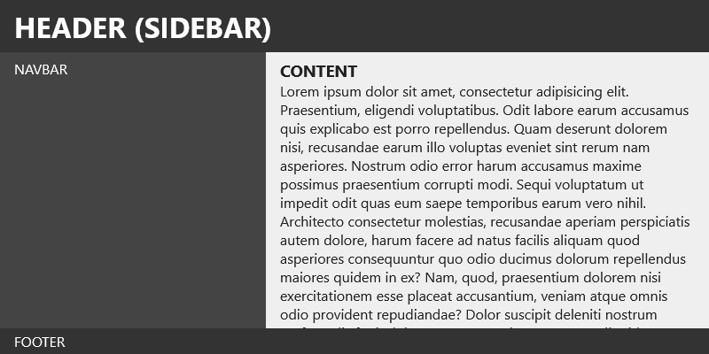

# `layout.js`


Das Widget implementiert ein responsives Navigationssystem, das automatisch zwischen mobilen und Desktop-Darstellungen wechselt. Es verwaltet die Navigation und passt deren Sichtbarkeit und Verhalten dynamisch an verschiedene Bildschirmgrößen an.

## Funktionalitäten

- Automatischer Wechsel zwischen mobilem und Desktop-Layout basierend auf einem konfigurierbaren Breakpoint
- Toggle-Mechanismus für die mobile Navigation mit animiertem Ein- und Ausblenden
- Overlay-System für verbesserte Benutzerfreundlichkeit auf mobilen Geräten
- Sidebar-Modus für spezielle Verwaltungsoberflächen
- Automatische Anpassung der DOM-Struktur durch Hinzufügen/Entfernen von CSS-Klassen

## Voraussetzungen

- jQuery `1.7` oder höher
- jQuery UI `1.8` oder höher (mindestens: Core => Widget)
- Moderne Browser mit CSS3-Unterstützung

## Methoden

| **Methode**   | **Beschreibung**                                     | **(Typ) Parameter** | **Standardwert** |
| ------------- | ---------------------------------------------------- | ------------------- | ---------------- |
| **`open`**    | Öffnet die mobile Navigation                         | -                   | -                |
| **`close`**   | Schließt die mobile Navigation                       | -                   | -                |
| **`destroy`** | Zerstört das Widget und entfernt alle Event-Listener | -                   | -                |

## Optionen

| **Option**       | **Beschreibung**                                | **Typ**   | **Standardwert** |
| ---------------- | ----------------------------------------------- | --------- | ---------------- |
| **`sidebar`**    | Aktiviert den Sidebar-Modus                     | `Boolean` | `false`          |
| **`breakpoint`** | Pixel-Wert für den Wechsel zwischen den Layouts | `Number`  | `1200`           |
| **`width`**      | Breite der Navigation im mobilen/Sidebar-Modus  | `Number`  | `300`            |
| **`duration`**   | Animationsdauer in Millisekunden                | `Number`  | `300`            |
| **`easing`**     | Easing-Funktion für Animationen                 | `String`  | `"linear"`       |
| **`navbtn`**     | Selektor für den Navigations-Button             | `String`  | `"#navbtn"`      |
| **`navbar`**     | Selektor für die Navigationsleiste              | `String`  | `"#navbar"`      |
| **`overlay`**    | Selektor für das mobile Overlay                 | `String`  | `"#overlay"`     |
| **`classes`**    | CSS-Klassen für verschiedene Zustände           | `Object`  | Siehe unten      |

### CSS-Klassen-Konfiguration (`classes`)

| **Option**    | **Beschreibung**                          | **Typ**  | **Standardwert**   |
| ------------- | ----------------------------------------- | -------- | ------------------ |
| **`desktop`** | Klasse für das Desktop-Layout             | `String` | `"layout-desktop"` |
| **`mobile`**  | Klasse für das mobile Layout              | `String` | `"layout-mobile"`  |
| **`sidebar`** | Klasse für das Sidebar-Layout             | `String` | `"layout-sidebar"` |
| **`active`**  | Klasse für den aktiven Navigations-Button | `String` | `"active"`         |

## Installation

```sh
git clone https://github.com/K3nguruh/layout.git
```

## Anwendung

### JavaScript-Einbindung

```html
<script src="assets/libs/jquery.min.js"></script>
<script src="assets/libs/jquery-ui.min.js"></script>

<script src="assets/layout.min.js"></script>
```

### Stylesheet-Einbindung

```html
<link href="assets/layout.min.css" rel="stylesheet" />
```

### HTML-Grundstruktur

```html
<!-- Automatische Initialisierung durch das data-plugin="layout" Attribut -->
<body id="layout" data-plugin="layout">
  <div id="header">
    <button id="navbtn"></button>
  </div>
  <div id="navbar"></div>
  <div id="content"></div>
  <div id="footer"></div>
  <div id="overlay"></div>
</body>
```

### JavaScript-Initialisierung

```javascript
/* Manuelle Initialisierung mit Standard Optionen */
$(function () {
  $("#layout").layout();
});
```

```javascript
/* Manuelle Initialisierung mit geänderten Optionen */
$(function () {
  $("#layout").layout({
    sidebar: true,
    breakpoint: 1000,
    width: 250,
    duration: 100,
    classes: {
      desktop: "custom-desktop",
      mobile: "custom-mobile",
      sidebar: "custom-sidebar",
      active: "custom-active",
    },
  });
});
```

## Beispiel-Layouts


<br>_Mobile Layout mit geschlossener Navigation_


<br>_Mobile Layout mit geöffneter Navigation_


<br>_Desktop Layout mit horizontaler Navigation_


<br>_Desktop Layout mit Sidebar Navigation_

## Support

Bei Fragen oder Problemen:

- Erstelle ein [GitHub Issue](https://github.com/K3nguruh/layout/issues)
- Kontaktiere den Maintainer über GitHub

## Lizenz

Dieses Projekt ist unter der MIT-Lizenz lizenziert. Siehe [LICENSE](LICENSE.md) für Details.
